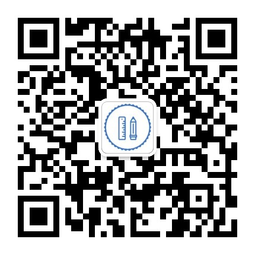
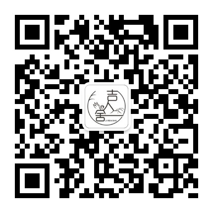
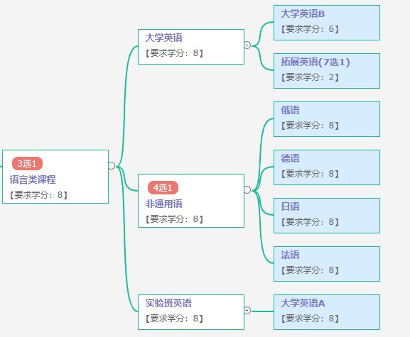
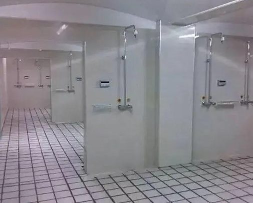

欢迎你们凭借着优异成绩来到美丽的吉林大学，这里是JLUBook团队，本指南整理了一些我们希望新生了解的知识和注意事项。时间仓促，难免出现缺少以及纰漏，欢迎大家可以联系我们批评指正。

您也可以将本指南转发给您的同学好友，让我们的指南帮助到更多的同学！

> 关于QQ群，从2023年开始的新生我们提供较为安全的吉大新生群，以及各个院系的QQ群。目前我们的新生群处于起步阶段，可以点击此处进入：[JLUBOOK 2022新生群](https://jq.qq.com/?_wv=1027&k=Qi8GdOcD)
> 
> *不要轻易直接在QQ上查吉林大学然后就直接进群，也许会遇到居心叵测的人。*

## 来到学校前

> **特别注意：**
> 
> 假期期间需要在吉大预定的就只有新书教材（请关注“吉林大学教材服务”公众号），其他的，诸如订购被子、自行车、理发卡、驾校都是非官方组织，与吉林大学并无关联。

### 我要带什么？

#### 证件资料篇🪪

1. 身份证、户口本等复印件（实际会用到1～2份，同时校内也有许多打印店）
2. 团员证及团员档案（入团申请书、入团志愿书等）、学籍档案（不可拆封）
3. 准备一寸二寸照片（红底白底蓝底都可以，多备几张会很方便，也可以存手机上留个底片）
4. 300~400 元现金（以备不时之需）（学费与住宿费是在吉大官网缴费平台统一收取，不需要带在身上，但一定别忘了交）
5. 户口迁移证明（迁户口者） 
6. 家庭情况表及贫困材料证明（申请助学金者，希望同学申请时实事求是） 
7. 生源地贷款回执单（有生源地贷款者）

#### 生活用品篇🧦

1. 适合东北天气的衣服和鞋子，夏季高温会在+30°左右，冬季低温会在-30°左右（但两种极限温度持续时间仅有三五天，大部分时间温度比较适宜），另外，长春气候比较干燥，风沙较大。
2. 床上用品：被套、枕套、床单、床帘、被子、枕头
3. 洗漱护肤品：牙具、洗面奶、洗发露、护发素、沐浴乳、卷纸、毛巾、防晒霜各类护肤 品等
4. 其他用品：收纳盒、镜子、梳子、水杯、衣架、雨伞、脸盆、暖水壶、拖鞋、澡筐、密 码锁、洗衣液
5. 数码配件：移动电源、充电台灯、充电器、插排、耳机等。
6. 军训：军训专用鞋垫以及腰带，可来学校后购买。

#### 学习用品及工具篇📝

1. 书包、笔记本、笔（包括涂卡笔）
2. U 盘、移动硬盘、电脑（根据需要）  
3. 订书机、便利贴、文件夹
4. 工具类：剪刀、透明胶、双面胶

#### 药品篇💊

1. 棉签、创可贴、纱布、碘伏或医用酒精
2. 口罩、酒精湿巾、手消
3. 防中暑药、感冒药、退烧药
4. 止泻药、助消化药
5. 过敏药  
6. 体温计
7. 花露水、风油精、清凉油等驱蚊用品

> 以上这些都是可能使用到的东西，帮大家整理出来，方便收拾行李。
> 
> **小提示：**
> 
> 1. 要看航运空运的要求，尤其是空运，更为严格，航运于 2022.7.1 实施新的携带方案，一定看仔细了！
> 
> 2. 吹风机、小锅、卷发棒、挂烫机都属于违章电器噢，小萌新们就不要带来啦。

### 如何来学校？

> 记得来学校之前，安装个导航软件吧!

#### 飞机✈️

如果你的出行方式为飞机且白天到达，到达长春龙嘉机场后建议乘坐高铁到长春站，非常方 便快捷，票价只要十块钱。机场巴士的价格也合理，好处是全天都有，缺点是路途偏长。从机场到学校有与校方合作的专车，接送机每车次100元，比自己打车相比划算但是需要预定。

#### 火车🚄

如果你的出行方式为火车，无论是长春站还是长春西站都是有地铁站的，部分校区门口也有 地铁站，可以直达，比较方便。（对于中心校区的同学，我是建议在长春西站下车，亲测打车距离能短一点）

关于火车票优惠的事情，需要下载“铁路12306”app并关注公众号“惠通学子”。到期末的时候，班级会发布通知要求资质绑定。首先要去行政服务中心绑一次（带好身份证，学生证，校园卡要带全），然后回家的时候在“铁路12306”APP上买学生票（普通火车硬座 - 半价，高铁二等座和火车硬卧 - 七五折）。最后去长春西站或者长春站售票大厅自助售票口，用身份证和学生证进行实名绑定，点击”资质绑定”菜单，刷身份证、学生证，之后才能取学生票。

> 附：打车方式
> 
> 一般而言在这种站点口，会有一堆出租车司机拉客，笔者有天然的排斥感，一是他会拉三四个学生，非常拥挤（还有大包小裹的行李），二是价格会比较高；笔者推荐使用导航软件自带的打车功能，和朋友一块打车，人均三十块钱就能到学校，会便宜很多。

> 附：地铁
> 
> 以下是几个校区的地铁站：
> 
> 中心校区：3 号线电台街下，往南走可以直接到达北门。
> 
> 南岭校区：1 号线工农广场下，往北走可以直接到达西门。
> 
> 朝阳校区：2 号线文化广场下，向北走即是校区。
> 
> 和平校区：建议打车，长春站和西站到和平的距离都还算可以。
> 
> 新民校区和南湖校区笔者不熟暂且不表（大概是坐公交打车二选一吧）

---

## 到达学校的第一天

> **特别注意：**  
> 
> 1. 不推荐在校内摊位上买自行车，闲鱼同城往往能找到更实惠的（建议开学前就联系好）
> 2. 进学校给你发小传单的，如健身房、驾校等，没有意向的话直接对 ta 摆摆手不理 ta就好了， 必要时可以假装自己是大二的。特别提防一些假借“社会实践”的名义兜售圆珠笔的“学长”，每年都有学生被骗，损失少则几十多则上百。
> 3. 直接有人闯入你寝室说“咱们需要 xxxx”直接跟他说不需要就好了。（尤其是那群先跟你套近乎， 说是什么老师，哥们，朋友，只要卖东西，都别信！）
> 4. 关于桶装水的问题，您可以和舍友商量是否需要，权衡卫生和便利。水房的热水也能直饮，但比宿舍里的饮水机相比还是略嫌麻烦。

### 签到入校

> 入校时，所有校区的同学都要记得，随身一定要带着身份证（可能还有新发下来的新生袋子）!

#### 中心校区

一般而言是允许车辆进校园，进的是东门（但是每一级可能存在变化，如果允许，一定按照 校方指挥进行出入并且即停即走，方便自己也方便他人）。之后，你需要去五月花广场找到自己学 院的所在地进行签到，拿好详细的东西去宿舍，然后就可以在寝室进行收拾整理，一定要跟舍友 好好相处哦!接下来可能会进行做核酸，每一级学生情况有所变化，一定要看班级群消息!**最重要的是带好那个刚发下来的新生袋子以及身份证，一定要带在身上!**

#### 南岭校区

南岭校区一般报道是从西门进入 会有学长学姐帮着拿行李，领着去报道，报到处会有专门 的行李车和巴士，分别将行李和人拉到对应的公寓楼下，进入公寓楼后会有签到能领取宿舍钥匙， 核酸在文化活动中心做，要记得带身份证和口罩。

#### 南湖校区

南湖校区的新生一般从西北门（靠近南湖广场侧）入校，目前不允许家长进校，但是会有上 一届的学长来帮大家运送行李，有不懂的问题可以去问他们。一般来说是直接前往宿舍进行报道， 之后班代会到宿舍来发放一些学校为大家准备的东西（譬如银行卡，月饼等）。

### 被褥等生活用品的购买

#### 中心校区

有一些距离家远的同学会在校内购买日用品，或者是进行用快递邮寄到学校（疫情期间可能 会出现一些问题，一定要留意一下这点内容）。 被褥可以在校内老体育馆前面那个广场上进行购买，一人一百多块钱。

如果在校内购买，可以去日新楼一楼进行购买（说点实话:会有点贵·只能说懂得都懂，一个垃圾桶卖 12 咱也不知道这是金子做的还是银做的） 如果去了日新楼，可以加一下打印社的微信 （但是不提供先给他发过去打印然后再去取的服务），顺便买一下带有吉林大学标志的稿纸，有 时候会用到。

如果进行邮寄，请跳转到下方有关快递的内容。（刚开学的时候快递会堆积如山，容易出现找 不到的问题，建议选择邮政和顺丰）

#### 南岭校区

被褥在附近商场有售，也可以校内购买（比较丑但质量还 ok）或从家中邮寄（建议不要邮圆韵邮 取快递比较远），另:吉大公寓允许安装窗帘等，大家可以在网上自行购买，建议买伸缩款（说实 话安装有点麻烦）。

#### 和平校区

如果是大一到和平的话，被褥会在开学的时候在宿舍那边有卖的，价格比较实惠也很耐用。 和平校区内只有两个超市，致远超市和食堂超市，可以根据距离自行前往。如果没有需要的东西， 出校门往东走就是一个很大的欧亚超市，也是不错的选择。

### 校园网入网以及获取邮箱问题

等开学我们会上传视频在 B 站上，请关注 B 站账号 JLUBook。还有一些超好用的教程哦!

同样的还有一个补加的 PDF 校园网入网指南的文件，如果阅读能力可以的同学可以看那个， 看不懂的话我们会在 B 站上传可视化的视频教程。

JLU校园网入网指南点击此处下载：[iCloud链接](https://www.icloud.com.cn/iclouddrive/0c5_OzFonKLYUm8xbnGiIjqsw)

### 学生卡，银行卡，学生证，电话卡

在你入校的第一天，签到时会获得一张学生卡（用于划卡吃饭、洗澡等日常使用），还有一张中国银行储蓄卡（并未激活，过几天之后校方会组织进行激活。此卡可与学生卡进行绑定，不过校园卡也可以用微信充值）。再之后你会得到另外一张交通银行储蓄卡（奖学金等会发到这张卡里面，也需要激活）。

电话卡并不是学校官方提供的服务，且校园网 ≠ 学生卡 ≠ 电话卡。这帮人会把电话卡换名字叫做 xx 校园卡或者 xx 学生卡，其实与吉大无关，也根本没必要到长春之后去校园换个号（早已不存在漫游费）。套餐的价格三家运营商大致相同，甚至套餐内容都几乎相同。如有意愿，您可以到校内的营业厅办理或在学长手上办理（价格相同但学长可以赚到部分提成）。个人体验：电信的信号更好，联通信号相对较差，而移动可以加入家庭网。

学生证不会立即下发，会在军训的时候集体组织拍照，之后才会下发。

### 干饭！

早餐供应时间：`6:30-9:00`，午餐供应时间：`10:30-12:30`，晚餐供应时间：`4:30-6:00`（供应时间外，尽管不可以去校内食堂，日新楼还是正常营业的，也可以点外卖`日新购`）

#### 中心校区

每个食堂用微信扫码或者学生卡付款都可以，最好的食堂肯定是日新楼的二楼和三楼。稍微 特殊一点的就是湖畔餐厅二楼的智慧食堂，你需要关注一个叫“吉林大学信息化”的微信公众号， 进入公众号首页右下角有一个“微应用”菜单，点击之后再点击“智慧食堂”，会让你绑定人脸信息， 操作完成后就可以去体验智慧食堂了；吃饭流程就是拿好餐盘，扫餐盘上的二维码或者放在人脸 识别台上进行人脸识别，然后进行自助，吃完也不用交钱，系统会直接扣钱。

#### 南岭校区

一餐为中式早餐与西点并存，实惠的米饭套餐，东北特色的打卤面

二餐一楼的小炒，二楼的米饭、砂锅、面、麻辣香锅、粉，还有旋转小火锅等

四餐集河南、北京、陕西等特色风味于一体，妈妈再也不怕小萌新饮食不习惯了（四餐也是 南岭最受欢迎的餐厅，想要避开高峰期的小可爱记得错开饭点哦） 

五餐特色低盐低脂菜，麻辣香锅，砂锅，黄焖鸡米饭减肥和健身的小可爱可以来这里哦 

六餐校园里唯一一个清真餐厅，喜欢吃清真食品的小可爱们冲冲冲，致远餐厅可以定外卖的 餐厅，直接送到宿舍楼下，谁又不爱呢

烤冷面十公寓对面和一教对面都有，夜宵必备! 

掉渣饼量大到可以当晚饭那种程度，不想吃饭的小可爱可以用掉渣饼来横扫饥饿。

水果捞位于致远餐厅旁，水果种类挺多，酸奶口味可以选择原味和黄桃味，还有果盒! 

水果位于二餐一楼，水果种类挺多。

#### 南湖校区

受限于南湖校区的校园面积，我们在校内能选择的食物种类较少，我个人推荐的是虹桥园餐厅旁边的二餐，还有四公寓对面山西面馆二楼的鸭货炒饭和烤肉饭

二餐厅不仅菜多价格也合适，适合和朋友一起聚餐

鸭货炒饭则是南湖校区的食物天花板。

当然前往南区体验日新楼也是一种非常不错的选择。

#### 和平校区

校区里严格来说只有一个食堂，此外有一个清真餐厅补充。

食堂的一楼是学校自己的，到点 就下班，所以要注意时间。二楼是外包的所以时间上会比较灵活一点。菜品请自行体验。一楼冬 天有免费玉米碴子粥，夏天有绿豆汤。

清真餐厅也算是外包，所以基本上全天去都可以做饭，上午十点下午两三点都没问题。不过餐厅还是太单调了，很容易就吃够了，所以出去吃或者外卖也 是不错的选择。

### 必备的软件和公众号

软件:别问那么多，直接下载“吉大 V 卡”以及“掌上校园”。  

吉大 V 卡（iOS/Android）:[官方链接](https://mp.weixin.qq.com/s/q5nGaawf64r8Ao-1KCnHmw) （吉大 V 卡的密码好像是你身份证号后六位）

掌上校园（Android，暂无 iOS 版本）:[下载链接](https://www.coolapk.com/apk/com.x90yang.HandSchool)

还有“复兴壹号”（交团费），“铁路 12306”，导航软件（百度/高德），“国家反诈中心”（学校要求的，任务，懂得都懂），“中国银行”，“交通银行”（这几个软件都要下）

公众号:海狸洗衣（洗衣机使用）、吉林省外文书店、吉林大学图书馆、吉林大学校医院、 吉林大学信息化、吉青飞扬与青春吉大（青年大学习）、校园邦办（宿舍报修）·······（按需关注）

> 还有，速速关注我们网站 [JLUBOOK](jlubook.com)和公众号`JLUBOOK` 和 `吉人社`!（夹带私货
> 
> 
> 

## 军训

### 军训相关
军训紧跟在报道两日之后，持续三周左右（下雨天不训练，训练一周会有一天休息。21 级因为延迟开学，军训只有两周）以 21 级军训为例：集合——11 点：训练（集合时间听从教官安排）11 点——14 点：休息（午休，通常下午集合时间早于 14 点）14 点——17 点：训练 17 点——18 点半：休息（干饭干饭）18 点半——20 点：训练（这个阶段也会训练但相对轻松，时不时会练习唱歌，观看表演）

### 军训贴士
一般会在前几天有组织买军训服，但是好像需要配个皮带，建议提前买一个备着。然后买军训那种专用鞋垫，越软越好，因为发的军训鞋鞋底特别硬。（记住一句话，买合身的就行，不用大一号！！！）

做好防晒，一定要买个防晒霜，男生也得涂！！！ 每天训练完会出一身汗，可以去洗澡，一定要注意卫生。

军训期间还是很晒的尤其是中下午，昼夜温差大更容易感冒，南方的同学来到长春可能会不适应干燥天气而脱皮。军训休息时间要及时补充水分，有不适及时告诉教官。

### 军训要求

**衣着**：男女统一军训服（短袖+外套），皮带，肩章，帽徽都要佩戴整齐。 鞋子也是统一的，发的军训鞋很硬，长期站脚会疼（最好自备软鞋垫/剪裁卫生巾）（军训前以学院为单位统一领取）

**发型**：男生要求寸头、平头，女生要求把刘海别起来，头发尽量盘在帽子里。大多数教官并不会对于头发要求严苛（不排除也有很严格的教官），根据去年军训，只要不是过分长，戴帽子看不出来就没什么问题。

军训为大学必修课，有学分，一般不建议请假，即使请假错过本届军训也需要和下一届新生补训。免训要求开具三甲医院的病情诊断。

## 选课

因选课系统彻底更新，目前没有经验可供参考，后续我们会把视频上传到 B 站 JLUBook 账号里，请大家耐心等待。

## 英语分级考试

开学的英语分级考试，通常在军训阶段中间某一天的上午考，按照新出的培养指南方案是分为AB两大类。A级是否直接满绩以及四级考试是否有时间差按照图片的意思是没有的，需要等开学后学校官方公告才能下定论。

A类为实验班英语，学分为8学时，要学四个学期，细分为AI、AII、AIII、AIV；B类为大学英语，目前来看也是要学四个学期，细分为BII、BIII、BIV，以及一个扩展英语（七选一，有通用学术英语、高级英语视听说、大学英语写作、英汉翻译基础、英美概况、英美文学赏析、中国文化的英文表达）

还有一大类是小语种四选一（非英语考虑），有日语、俄语、法语、德语。

英语分级考试的样题并不好找（开学后复印社可以买得到，但是不建议买，没必要，重点是在听力上），建议同学们拿高中英语考试每次月考的模拟题来去练手（找最难的那一个），重点去练阅读。分级考试的题型为四级考试题型，难度比高考难，比四级简单。重点可以去练习一下听力，大部分考的不好的都是差在英语听力上。

总而言之，只要能保证高中英语水平，再加上练练听力，分级考试就不是什么难事，四级也是一样的！

关于英语免试的公告得需要等开学才能发布，目前改动较大，所以以前的资料没有太大的参考价值。大家有个心理准备就行，校内公告可以用上文提到的“掌上校园”app进行查看。

## 教材及作业购买

教材是由吉林省外文书店负责的，中心校区在日新楼四号门四楼。

电子书获取的视频教程:[bilibili链接](https://www.bilibili.com/video/BV1cg411X7gS)详细内容在 JLUBook 官网，我们在学习资源里提供了一些电子教材，但是缺了很多，如果有补充请联系我们。

二手教材各大校区的书店都有售卖，比如中心校区的易通书店（日新楼六号门六楼）、外文书店。其他校区可以另行补充。

教材购买有四种方式，新书购买，新书租赁，二手书购买，电子书使用，利弊如图所示:

| | 新书购买 | 二手书购买 | 租赁 | 电子书 |
|:--|:--:|:--:|:--:|:--:|
|准备 | 需要关注微信公众号“吉林大学教材服务” | 无，到学校购买即可 | 需要关注微信公众号“吉林大学教材服务” | 平板 |
| 价格 | 贵，每本书在定价基础上打八折 | 便宜，每本书在定价基础上打五折左右 | 便宜，每本书在定价基础上打三折左右 | 最便宜，每本书价格为五块钱以内，甚至是免费 |
| 便携度 | 不方便 | 不方便 | 回收之后较为方便 | 最方便 |
| 书本质量 | 全新 | 旧，留有学习印迹甚至是缺页。如果这本书没有学习痕迹，卖家会说这本书是全新的，你得花八折的钱买（有点坑）| 新旧全凭运气，统一调配 | 全新 |
| 回收  | 自愿回收 | 自愿回收 | 强制回收，如果不想回收一些书，需要花八折买下 | 无 |
| 用时 | 短 | 长 | 短 | 长 |
| 其它问题 | 新书需要到店取，可能出现新书未到货但是课开始上了的情况（有的学院是直接把教材批量送到寝室楼门口，然后下楼去取）| 一是书籍质量问题，二是有可能遇到改版的情况 | 不详，如果出现疫情这种情况，还书是个麻烦事 | 书籍查找会有一点麻烦，新书可能出现找不到的情况，或者出现平替这种情况：比如《经济学基础》你找不到，但是《经济学原理》（两本）你能找到，一个是精简版，一个是详细版 |

如果是新书购买或者走租赁，首先需要在开学前一个月关注微信公众号“吉林省外文书店”，点击公众号首页的教材订购，然后进行购买；之后需要到店去取。（首先要交1000元定金，多退少补）（第一学期可以购买新书先过渡一下，因为新生没有经验加之比如2022年培养指南方案更改导致教材发生变化的情况，然后之后就直接买二手教材就行）

如果是二手书购买，可以找同院的师哥师姐购买，或者去书店直接选购，请注意买完不给退，只能换（建议先准备好书单以及书籍所对应的版本再去买)

如果是电子书，可能问题就是翻页有点麻烦，得之后使用的时候做标签列大纲，自己做目录（但是有的PDF有电子目录，就用不着这一步）

本人的建议：电子书 > 二手书 > 租赁 > 新书购买

对于作业，有两种情况，老师直接下发作业，或者去奔腾复印社买（中心校区在南苑八公寓后面）。

## 图书馆

### 其他提醒

新生是进不了图书馆的，会有图书馆的负责人按学院一个一个进行开会讲解，之后会进行答题，院平均正确率达到一定标准就会对院进行开放。

| 校区 | 说明 |
|--|--|
| 中心校区 | 关于鼎新图书馆教室预约，需要进入吉大图书馆官网，在网页中下部有一个“座位预约”的按钮，点击然后进行预约。**如果想预约，建议在23:50左右开始留心一下网站，不是0点开启新一天的预约** |
| 南岭校区 | 馆内藏书主要是一些工学类书籍，其他书籍可以在校内图书馆网站找电子版也可以其他校区图书馆借阅。一楼右侧有致远咖啡厅。二楼至五楼可，自习每层楼都有热水。自修室有插座，适合带电脑自习的同学。图书馆月末周三下午11:00-18:30闭馆，自修室除外。 |

### 官方介绍

#### 图书馆什么时间开馆啊？

阅览室的开放时间为：

周一至周日 8:00-22:00

月末周三  8:00-11:30  18:00-22:00

#### 图书馆有微信账号吗？

微信搜索“吉林大学图书馆”或“jlulib”

#### 一卡通有什么用呢？

同学们可以用一卡通进入图书馆、借阅图书，缴纳超期罚款。使用微信或图书馆主页查询个人借阅信息时，借阅证号码为一卡通号码，默认密码为jlu@1234abc，千万要记住啦！
图书馆文明守则	衣着整洁，交明礼貌、保持安静、爱护图书、不吸烟、 不占座、外卖禁止入馆

#### 怎样查询馆藏书目？

1. 微信查询：关注吉林大学图书馆微信，点击菜单“我的图书馆“——“馆藏查询“即可。
2. 访问图书馆主页查询：进入图书馆主页地址http.//lib.jlu.edu.cn，点击“馆藏目录”，输入图书题名，便会显示出该书本馆是否有馆藏，索书号及馆藏位置。如显示“charge out“，表示该书目前是“借出”状态。记住啦！登录时，账号为一卡通号，默认密码为jlu@1234abc

#### 怎样借书？

找到图书后，可持一卡通和所借图书去阅览室的服务台或自助借还书机处办理借书手续。

#### 借阅规则有哪些？

重要的事情说三遍：借书免费！借书免费！借书免费！

1. 普通中文图书无借阅册数限制，外文图书教师、研究生限借5册，本科生限借3册。
2. 凭一卡通可在全校六个校区七个图书馆借书；借书需到各馆去借，不可异地借阅，可在各校区分馆就近还书，即可异地还书。
3. 借还书手续：在各阅览室服务台或自助借还书机上办理。
4. 图书借期为31天，只能续借一次，借期31天，可在网上自助办理。
5. 图书超期每本书每天罚款0.1元。罚款金额在30元以内，可持一卡通至自助借还书机处交纳罚款；罚款金额超过30元，需至阅览室内服务台用一卡通交纳罚款。
6. 寒、暑假前到期的图书如不归还，逾期时间含寒、暑假期；寒，暑假期间到期图书，只要在开学一周内归还，不视为逾期，如不能在开学一周内归还，逾期时间含寒、暑假期。

#### 图书馆有哪些数字资源？

1. 图书馆拥有200余种中、外文数据库，包括电子期刊、电子图书、学位论文、考试学习等数据库，供我校师生使用。所有数字资源均可通过图书馆官方网站的数据库列表进行查看、访问。
2. 图书馆网站提供一框式检索服务，一个窗口检索全部资源：
3. 在图书馆主页，点击上方菜单″资源“――″数据库”即可进入资源导航页面。在该页面，可通过“字顺”、“学科“、”文献类型“三种方式浏览所有已购买的数据库。

## 快递点

### 中心校区

首先，记住一句话，网购什么东西一定问问卖家，能不走中通就不走中通！（因为中通在校外，取快递会非常麻烦，如果你不想跑腿有那种微信群代取快递，但是价格······）

快递写法：吉林省长春市朝阳区双德乡前进大街2699号吉林大学前卫南区。**（其他校区的就是改一下区，街道，号码以及校区，地图定位是咋写的你就咋填）**

取快递的位置：如果在淘宝购买的东西，打开支付宝，会有“我的快递”和“菜鸟裹裹”这两个小程序，那上面都有取货位置（和地图对应一下就好）；如果是京东，就在南苑八公寓乐收二部快递点取就行；如果是国际快递件（EMS、SAL、AIR这种的）快递员可能出现没给你打电话的情况，自己查一下快递进度，给快递小哥打电话，这类快递在北门收发室取，同时要拿好校园卡身份证什么的，得进行核对（跟校园内那个邮政快递点没啥关系）。

### 南岭校区

小南门是圆通韵达的快递件，南门外有个邮局是负责邮政的快递件（如果想寄信可以去这，或者是二教二楼的收发室，取信寄信都可以），二餐对面的乐收点就是其他的快递件了。

### 南湖校区

南湖校区的快递点在校区外，是隔壁邮电小区内的菜鸟驿站，具体位置为5栋的101门（直接问学长学姐或者小区的居民会更快）

### 和平校区

只有一个快递点，在浴池（清真餐厅）旁边。京东是在学校门口打电话让你出去拿（出校门肯定是近一点的但是会被电话催的）。如果是通过邮政寄的文件，有可能被送到机关楼。邮寄地址写绿园区林园街道吉林大学和平校区学生X公寓即可。

## 体育馆

### 中心校区（宋志平体育馆）

1. 对校内师生健身的开放时间：周一至周五：早晨6:00﹣早晨7:30，中午12:00﹣下午1:00，晚上5:30﹣晚上9:00；周六、周日：早晨6:00﹣晚上9:00。  
2. 进体育馆须出示校内一卡通等有效身份证件。  
3. 自觉爱护体育馆内环境卫生，禁止在馆内吸烟、使用明火、吃食品（包括嚼口香糖）、喝饮料。吐痰、乱扔杂物等行为。  
4. 禁止患心脏病、传染病、精神病及酗酒者入馆活动。  
5. 禁止携带玻璃制品、金属制品、尖制品，以及易燃、易爆、腐蚀性、污染性的危险品入馆。雨雪天禁止将滴水雨具带入各活动场馆。  
6. 进入各活动场馆，必须换干净的运动鞋或佩戴鞋套，禁止穿高跟鞋、带钉皮鞋及其它有损地面的鞋子。  
7. 禁止在规定活动场地外进行体育运动（包括场地线外的边场、通道、走廊等）。  
8. 自觉爱护场馆、设施，如人为损坏，须恢复原状或按价赔偿。  
9. 请妥善保管自己的贵重物品，如有丢失，责任自负。  
10. 自觉维护体育馆内的正常秩序，禁止在馆内大声喧哗、追逐打闹、打架斗殴、赤背等不文明行为。  
11. 馆内淋浴间仅对体育教师、教练和运动队队员开放。  
12. 请师生提前两天拨打活动预约电话，预约成功后在1号门入口处验证入馆，并按预约的时间、场地，每天预约时间为下午1:30﹣晚上7:30。  

活动预约电话：15326412159

### 南岭校区

开放时间：8:00-20:00  

馆内可进行乒乓球，羽毛球和篮球等运动。  

进体育馆需要额外准备一双运动鞋，换上后才可以进入。

### 和平校区

文体中心只要不上课一般都可以进，里面是羽毛球社团和篮球社团的活动场所，会交替着活动。室外有露天的篮球场和排球场。

## 洗澡

开放时间：夏季：11:00-21:00，冬季：11:00-20:00  

请同学自己根据地图找到洗澡位置。需要带校园卡或者通过“吉大V卡”app进行预约。（二选一，软件下载请[点击这里](https://mp.weixin.qq.com/s/q5nGaawf64r8Ao-1KCnHmw))洗澡的时候每到六毛就断一次水，如果用app预约的话，最多用断水最多三次（也就是2.4元）

如果在没有疫情的情况下可以直接去洗，可以备一个密码锁关箱子。  

如果有疫情可能会有院内通知群，按照时间发卡去洗。

~~我求求洗澡的同学别带个蓝牙耳机，蓝牙耳机掉柜子缝里拿不出来的不是一个两个（别问我怎么知道的~~

## 就医

**首先，感谢校医院，药是真便宜啊！！！**

接下来说就医的事情，也没啥好讲的，开学的时候会让你办理医疗证，去校医院的时候把证带着就好（最好把身份证什么的都带上）

## 寝室

### 床铺尺寸

 大多数宿舍的床铺尺寸为`1.9m * 0.9m`（部分宿舍的床尺寸会有差异，一般按照`1.9m * 0.9m`购买都没有问题）

以下为中心校区的床铺尺寸：

-   大学城一公寓为2m*0.9m
-   大学城二、三公寓为2m*0.9m
-   文苑一公寓为1.9m*0.96m
-   文苑四公寓为1.9m*0.9m
-   文苑六、八公寓1.95m*0.9m
-   南苑一、二、三公寓为1.95m*0.9m
-   南苑四、九公寓为1.9m*0.85m
-   南苑六公寓为2m*0.85m

### 断电时间

寝室断电时间：周五、周六为00:00~06:00，其余为23:30 ~ 次日06:00（即周五周六晚半小时断电）；考试周不断电。*看看谁更卷！*

公寓开门时间：夏季5:45，冬季6:00；关门时间：周日至周四23:30， 周五、周六23:45（如果有特殊情况，可以敲门让宿管大爷大妈开门，态度要好）

### 基础设施以及寝室样貌

宿舍提供热水，洗衣机，以及门钥匙。钥匙要保管好，寝室如果出现需要维修的东西，在公众号“校园邦办”即可反馈。洗衣机需要在公众号“海狸洗衣”付费使用。  

宿舍图片，我们后续会上传，粗略来说都是上床下桌，有水房和公共洗漱间（除了北苑三北苑四是人上人之外，带有公共洗浴间；另外有的宿舍配备独立卫生间，可以搞个洗衣机和淋浴设备。别的宿舍都很普通）  

什么时候有宿舍安排，需要等学校那头有通知（应该是进入迎新服务网进行查询，所以没必要着急）一般而言，一个院系专业是在一块居住，如果人少，可能会出现班级不同而住在一起的情况。

**多说点内心话：洗衣机不要放袜子内裤，互相体谅一下吧！**

## 体测

体测是大学体育课成绩的一部分（不计入成绩，体测及格就行），可以用支付宝搜索大学体测，就有相关的小程序，你只需要把你的分数录入进去，结果及格就行，不用太担心，绝大多数的人都是可以及格的。