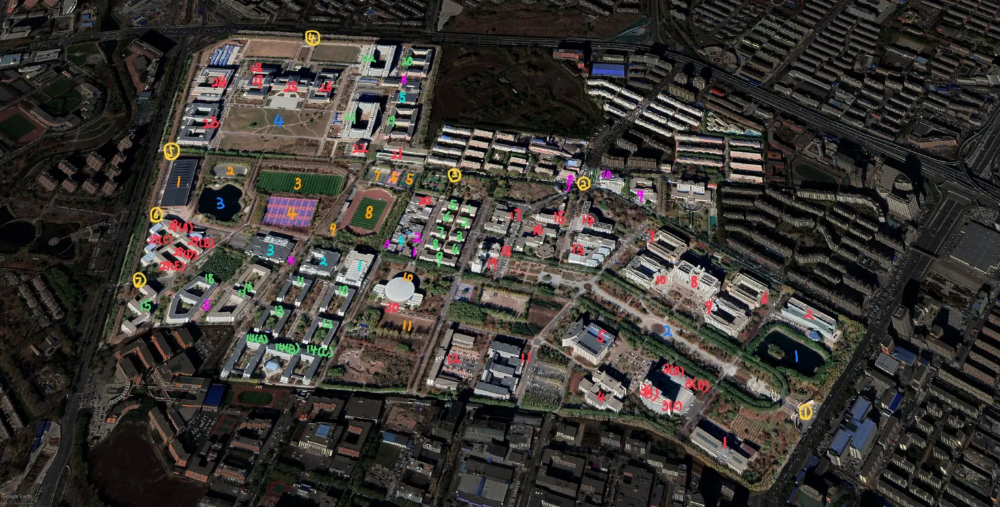
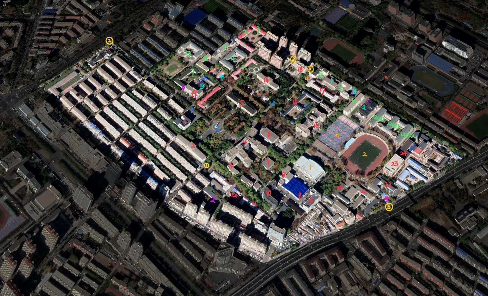

---  
title: 各校区地图
description: 汇总了各个校区的地图，并做好了标注
date: 2022-07-14  
slug: 校区地图
image: cover.jpg
categories:  
    - 地图  
---
## 前卫南区（中心校区）

> 黄色为大门（黄色）；红色为教学楼、办公楼；绿色为宿舍（绿色）；深蓝色为公共场地（深蓝色）；橙色为体育设施（橙色）；浅蓝色为食堂（浅蓝色）；紫色为其他设施（紫色）。
> 
> ABCD 字母指的是该楼分的 ABCD 区，下述忽略此点。
> 
> (若有错误，请大家及时反馈，感谢!)

### 大门（黄色）

| 1.东门 | 2.北门 | 3.西北一门 | 4.西北门 |
|--|--|--|--|
| 5.西南二门 | 6.西南一门 | 7.西南门 |   |

### 教学楼与办公楼（红色）

| 1.南区教学楼 | 2.无机超分子楼 | 3.东荣大厦 | 4.第三教学楼 |
|--|--|--|--|
|5.中心图书馆 | 6.生命科学楼 | 7.物理楼 | 8.唐敖庆楼
| 9.理科综合实验楼C区  | 10.理科综合实验楼D区 | 11.计算机楼 | 12.匡亚明楼 |
|13.逸夫教学楼  | 14.麦克德尔米德实验室 | 15.外语楼 | 16.萃文楼 | 
| 17.逸夫图书馆 | 18.文科楼 | 19.（老）行政楼 | 20.考古与艺术博物馆 |
| 21.高压合成楼 | 22.高压实验室 | 23.李四光楼 | 24.超硬材料国家重点实验室综合楼|
| 25.鼎新楼 | 26.鼎新图书馆与校史馆 | 27.鼎新大讲堂 | 28.行政服务中心 |
| 29.经信楼 | 30.体育教学楼 |

### 宿舍（绿色）

| 1.文苑一舍 | 2.文苑二舍 | 3.文苑三舍 | 4.文苑四舍 |
|--|--|--|--|
| 5.文苑五舍 | 6.文苑六舍 | 7.文苑七舍 | 8.文苑八舍 |
| 9.文苑九舍 | 10.南苑一舍 | 11.南苑二舍 | 12.南苑三舍
| 13.南苑四舍 | 14.南苑五舍 | 15.南苑六舍 | 16.南苑七舍|
| 17.南苑八舍 | 18.南苑九舍 | 19.北苑一舍 | 20.北苑二舍 |
| 21.北苑三舍 | 22.北苑四舍 |

### 公共场地（深蓝色）

| 1.晏湖 | 2.五月花广场 | 3.清湖 | 4.鼎新广场 |
|--|--|--|--|

### 体育设施（橙色）

| 1.宋志平体育馆 | 2.轮滑场 | 3.足球场 | 4.篮球场1 |
|--|--|--|--|
| 5.篮球场2 | 6.排球场 | 7.网球场 | 8.田径场 |
| 9.器材室 | 10.（老）体育场 | 11.溜冰场 |

### 食堂（浅蓝色）

| 1.日新楼 | 2.莘子园餐厅 | 3.湖畔餐厅 |
|--|--|--|
 |  4.翔远，致远，鸿鹄以及四餐厅 | 5.基础园餐厅 |

## 南岭校区

### 大门（黄色）

| 1.南门 | 2.西门 | 3.北门 | 4.北一门 |
|--|--|--|--|
| 5.东门 | |

### 教学楼与办公楼（红色）

| 1.仿生楼 | 2.基础科学实验楼 | 3.创新创业教育学院（原管理学院）|
|--|--|--|
| 4.逸夫教育大楼 | 5.第二教学楼 | 6.文化活动中心 |
| 7.计算机教学与网络中心（计算机楼）| 8.汽车仿真设计工程研究中心（俊民楼）| 9.车辆产品检验室 |
| 10.生物与农业工程学院 | 11.生物工程学院高压薄膜研究所 | 12.农业机械展示场 |
| 13.能源与动力大楼 | 14.图书馆（工学馆） | 15.第三教学楼 |
| 16.逸夫机械材料馆 | 17.第一教学楼 | 18.汽车工程学院 |
| 19.交通学院楼 | 20.吉林省暨长春市锻压学会 | 21.超塑性与塑性研究所 |
| 22.学生创新创业实践基地 | 23.工程训练中心 | 24.机械制造实验室 |

### 宿舍（绿色）

| 1.学生一公寓 | 2.学生二公寓 |  3.学生三公寓 | 4.学生四公寓 |
|--|--|--|--|
| 5.学生五公寓 | 6.学生六公寓 | 7.学生七公寓 | 8.学生八公寓 |
| 9.学生九公寓 | 10.学生十公寓 | 11.学生十一公寓 | 12.学生十二公寓 |
| 13.学生十三公寓 | |

### 公共场地（深蓝色）

| 1.中央大道 | 2.中心广场 | 3.杏花大道 |
|--|--|--|

### 体育设施（橙色）

| 1.体育馆 | 2.体育场 | 3.篮球场 | 4.羽毛球场 |
|--|--|--|--|

### 食堂（浅蓝色）

| 1.学生一餐厅 | 2.学生二餐厅 | 3.致远餐厅 |
|--|--|--|
| 4.学生四餐厅 | 5.学生五餐厅 |

### 其他设施（紫色）

| 1.南岭浴池 | 2.校医院 | 3.校园警务室1 | 4.校园警务室2 |
|--|--|--|--|

## 南湖校区

### 大门（黄色）

| 1.西北门 | 2.北门 | 3.狗洞（bushi）| 4.南门（取外卖） |
|--|--|--|--|

### 教学楼与办公楼（红色）

| 1.第一教学楼 | 2.行政楼 | 3.礼堂 | 4.应用技术学院 | 
|--|--|--|--|
| 5.研究院 | 6.第二教学楼 | 7.图书馆 | 8.马克思楼 |
| 9.第三教学楼 | 10.职工楼（?） |

### 宿舍（绿色）

| 1.一公寓 | 2.二公寓 | 3.三公寓 | 4.四公寓 |
|--|--|--|--|
| 5.五公寓 | 6.六公寓 | 7.南湖会馆 |

### 公共场地（深蓝色）
| 1.南湖广场 | 2.韶光园 | 3.新生广场 |
|--|--|--|

### 体育设施（橙色）

| 1.操场 | 2.体育馆 | 3.篮球场 | 4.排球场 |
|--|--|--|--|

### 食堂（浅蓝色）

| 1.食堂（浅蓝色） | 2.三食堂（浅蓝色） |
|--|--|

### 其他设施（紫色）

| 1.浴池和小超市 | 2.校医院 | 3.致远超市 |
|--|--|--|