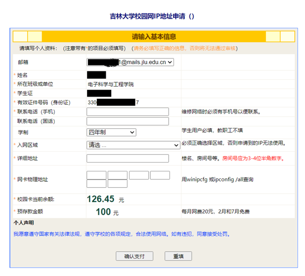

## 背景知识

总的来说：有线网能跑>6MB/s，局域网内最高可跑到千兆速率；无线网限速为1MB/s（具体速率因寝室、设备性能、网线质量而异）

推荐使用电脑连接有线网，然后通过电脑的个人热点功能开启WI-FI，将网络共享给手机。

## 开通网络

### 准备工作

**(1)校园卡余额**

校园网网费为20元/月，新用户开户后至少需要使用五个月，否则不予退户退款，故开网时要保证校园卡余额大于120元，包含了五个月共100元的网费，以及系统要求支付后卡中至少保留的20元，用以保障餐厅、浴池洗澡等其他消费。

**(2)网线与网口转换器（如果需要连接有线网）**

寝室墙上网口为千兆口。要实现高下载速度，请使用CAT 5e(超五类)及以上的网线。如果您的电脑没有网口，请提前购买并使用[Type-C转RJ45网口的转换器或拓展坞](https://search.jd.com/Search?keyword=type%20c转网口)。百兆速率的有线网卡即可跑满校园网的网速，但我们仍然推荐你选购千兆速率的网卡，其在多数情况下质量更好，可以给你带来更稳定的网上冲浪体验。

### 获取JLU邮箱

> 我们推荐使用电脑进行开户，手机/平板等移动端设备连接JLU.PC用于网络开户理论上也可以，但您可能会遇到一些兼容性问题

1. 打开电脑用无线网链接`JLU.PC`这个校园网WiFi，首次连接之后会自动跳转网页[https://login.jlu.edu.cn/](https://login.jlu.edu.cn/)。如果没有弹出请手动输入该网址，同时不要关闭该网页，接下来会用到。

2. 在浏览器打开新的标签页，输入网址[https://ip.jlu.edu.cn/pay](https://ip.jlu.edu.cn/pay)；然后输入校园卡（吃饭洗澡刷的卡）号、密码登录。(默认密码为身份证号后六位，若最后一位为X，则向前顺延一位；若想修改校园卡的密码可在校园内的圈存机上查询修改，但比较麻烦）
3. 在接下来的页面中，点击“查询邮箱”，你就可以获取你的学校邮箱（账号），该邮箱和你的校园卡关联；然后修改密码。一定要牢牢记住这个邮箱账号和密码，在校园哪里都能用得上！

> 这里面强调一下这些吉大账号密码的事情，在学校你会用到三组账号密码，第一组就是校园卡+身份证号后六位（用来登陆“吉大V卡”、校园网自助营业厅、校园卡平台）；第二组是校园邮箱账号+修改后的密码（绝大多数吉大的网站都要用到）；第三组是你的学号(八位数字)+修改后的密码（用于教务管理的服务）（所以笔者建议除了校园卡的密码为身份证号后六位之外，其余的有关吉大的密码都设置为一个，较为复杂一点的！）

### 网络开户

1. 回到校园网自助营业厅的那个页面，点击“网络开户”并输入对应信息。关于网卡物理地址一栏，除非您符合下述情况，可以随意填写12位十六进制数（如12个0）否则请参考下方的[“查询MAC地址”](http://localhost:1313/p/jump-into-jlunet/#查询本机物理地址mac地址)部分，填写真实的MAC地址，或之后使用网上营业厅的“变更MAC功能”进行修改。

	- 确定在你今后的一段大学生活中不会使用有线网上网，暂时只打算用无线网的；
	- 暂时没有自己的电脑，而临时在其他同学的或公共的电脑上进行校园网开户操作的；
	- 使用手机开户的；
	- 打算使用有线网，但是你的电脑没有网线接口的（在轻薄本和全能本上会比较常见）或是暂时没有网线转换器和网线的。

> 注意：**入网区域和寝室楼宇名务必要输入正确！** 给的楼宇列表不是按正常顺序排的（别看见一二三四五号楼就以为下一个就是六号楼）

2. 此时，确认支付之后会弹出一个分配IP地址等一系列信息，一定要拍张照记住这些内容，接下来会用到。（如果没有请返回校园网自助营业厅的首页，点击“查询信息”就可以查到）相关信息发送邮件失败不影响开网。
3. 填写完成之后，回到最开始弹出的网页，然后安装客户端（Windows系统的电脑就安装Windows客户端就行，默认安装在C盘，请勿移动文件夹，如果在电脑桌面图标没有出现客户端，请按照该路径在此电脑打开客户端`C:\Drcom\DrUpdateClient\DrMain.exe`）安装完毕后点进进入，输入自己的邮箱账号和更改之后的密码。（邮箱账号的后缀，也就是`@mails.jlu.edu.cn`不用填写，然后点击记住密码，不建议勾选自动登陆，某些情况下会和Win10系统冲突而产生一些不影响使用的小bug）最后点击登陆。

自此，校园内的无线网均可正常访问。P.S.不要忘记及时给校园卡充值。

### 有线网入网补充

除下述操作外，与"网络开户"操作一致。

#### 查询本机物理地址(MAC地址)

> 要查找的是您的有线网卡的MAC地址，不要使用无线网卡的MAC地址。如若您在使用外置网卡，找到的是外置网卡的MAC地址，与电脑自身无关。这意味着如果您之后更换了外置网卡，需要重新查找其MAC地址进行配置。

##### Windows系统（多数情况）

点击屏幕下方任务栏的“Windows徽标”，点击“设置”，点击“网络与Internet”，选中“以太网”，向下翻就可以找到一个12位16进制数的物理地址（每两个一组，一共六组，如下图所示）。

##### macOS系统

> 目前macOS部分的教程基于macOS Monterey，系统更新后下述的部分操作或截图可能会过时。

若要查询有线网卡的MAC地址，请选取苹果菜单ð >“系统偏好设置”，点按“网络” ，然后在左侧的列表中选择“以太网”或您的外置有线网卡。之后请选取右下角的“高级”。然后选取“硬件”选项卡，即可看到你以太网或外置有线网卡的MAC地址。

    

获取到MAC地址后，将其填到"吉林大学校园网IP地址申请"的"网卡物理地址"一栏，或使用网上营业厅的“变更MAC功能”进行修改（有时间限制）。

#### 接入网线

找到宿舍内的交换机（白色小盒），交换机的位置可能在寝室门旁边的墙上，或在某个桌子下面的墙上。将网线的一端插在交换机上，另一端插电脑上。

#### 修改IP地址

##### Windows系统（多数情况）

打开电脑的“控制面板”，在弹出控制面板窗口的右上角输入“查看网络连接”，右键点击“以太网 网络4”（状态为连接的以太网），然后点击属性，在弹出的对话框中双击“Internet协议版本4（TCP/IPv4）”，接着把“自动”全部改成“手动”，把五个空全填上。

##### macOS系统

选取苹果菜单ð>“系统偏好设置”，点按“网络” ，然后在左侧的列表中选择“以太网”或你的外置有线网卡。在右侧点选“配置IPv4”，并将其更改为“手动”。之后你就可以在下方更改IP地址、子网掩码、路由器（又称网关）等信息。 

    
 
修改完毕后，不要忘记点选右下角的“应用”。

DNS服务器在大多数情况下会自动搜索，如果您要手动配置DNS，请选取取右下角的“高级”，然后选择“DNS”选项卡，在“DNS服务器”一栏的下方点击“+”以新建一个DNS服务器地址，或选取要删除的地址后点击“-”以删除一个DNS服务器地址。

  

步骤五修改完毕后，不要忘记点击右下角的“好”，并应用您的修改。

macOS一般会自动选取最合适的网络服务，若要手动更改，请在下方的更多选项中选取“设定服务顺序”。

之后您可以通过拖移服务来更改顺序，更改完毕后请点击“好”，并应用您的修改。

## 不同无线网的区别

网络开户成功后，就可以使用学校的无线网了。学校的无线网有2.4Ghz和5Ghz两个频段，带有“-5G”后缀的为纯5GHz信号，其余为2.4GHz/5GHz双频合一信号。

### JLU.PC

直接连接（仅限电脑可用），连接后运行“吉林大学校园网认证客户端”进行认证。

### JLU.TEST

直接连接，随后会在浏览器弹出窗口，输入邮箱账号和密码即可完成认证。

### JLU.NET

需要在连接时进行认证，具体参数如下：

| 密码      | JLU邮箱账号的密码        |
|---------|-------------------|
| EAP方法   | PEAP              |
| 阶段2身份验证 | 安卓手机选择无，鸿蒙手机选择GTC |
| CA证书    | 使用系统证书            |
| 域名      | jlu.edu.cn        |
| 身份      | 邮箱账号@以前的部分        |

每个网络最多同时登陆一台设备，之前的设备会被中断连接，但不同网络间不会相互影响。这意味着您最多可让三台设备同时上网（连接不同的网络）。

## 补充说明＆常见问题解决

若以后需要更改MAC地址，请注意一天可以且仅可修改一次。若有特殊情况，请及时联系校园网服务中心帮助修改，联系方式是`85166000`。

请用习惯的方式记录相关信息，在以后的大学生活会用到。如果忘记，也可以随时进入自助营业厅点击查询信息栏目查询IP信息。

笔记本和台式机用户无线上网时请优先选择JLU.PC，至于其他几个WiFi能否在电脑上连接请自行探索，反正网络中心的建议是一律连JLU.PC。

当无法判断电脑连的是无线还是有线时，可以观察客户端登录成功后的界面，IP为49打头的是有线网，否则是无线网。

电脑在连接有线网络的情况下，可以给手机等设备开无线热点。但是由于寝室电磁环境较为恶劣(校园网的WiFi占据了大量无线信道)，有时可能只能开启2.4GHz的热点。

解决校园网问题的通式：重启电脑→卸载客户端后重新下载安装客户端→检查第四步中的设置是否被初始化→问学长→致电网络服务中心寻求帮助→开摆！

如遇错误提示“ldap auth error”，首先请了解周围的同学是否遇到同样的问题，如果是，要么耐心等待一会儿，要么致电网络中心。如果仅仅是个人碰到这个问题，请先尝试自行进入自助营业厅修改吉大邮箱的密码，然后重新登录客户端，若依然提示“ldap auth error”，请及时联系网络中心寻求帮助。（备忘录：最近一次小范围出现此类问题的原因是违规使用了非官方的自动健康打卡程序）

认证登录后提示“账户不存在”的，大概率是欠费了，请进入自助营业厅充值；若不是欠费的原因，请及时联系网络中心解决。（一般快没钱了登陆网络客户端会有窗口提醒你余额不足请及时缴费）进入“校园网自助营业厅”首页之后，点击“网络续存款”，点击邮件地址，进行缴费。

电脑可以在连接无线网或有线网情况下，给手机等其他移动设备开热点，请自行探索。

客户端登录成功后，电脑右下角任务栏会有一个小地球，这个小地球可能会固定在任务栏，也可能会收在隐藏图标内，甚至可能会消失不见，都没有关系，能上网就行。强迫症请尽快重启设备。

在寝室内装路由器在技术上是可行的。感兴趣的同学可以捣鼓一下，淘宝上也有相关路由器。但是我们不提供相关的教程，同时也不建议大部分同学尝试。虽然这方面查得确实不严，但的根据《吉林大学校园计算机网络用户守则》第六条，其为违规行为：任何用户必须使用经过网络中心授权使用的IP地址，每个经授权的IP地址只供一台计算机使用。禁止用户采用任何形式（例如安装路由器、代理服务器、网关等）将多台计算机共用一个IP地址上网，否则将被视为干扰和破坏网络秩序的行为，将受到停止使用网络、罚款、校纪处分等处罚。

包括网线在内的所有电子相关产品均不建议在实体店(包括校内的)购买，除非是真的急用。推荐的购买渠道为京东自营/淘宝高评价店铺。购买网线时，请提前测量好所需长度，遵循“买长不买短”的原则。

关于校园网服务中心的联系方式。如有问题可以在工作时间拨打校园网服务中心电话。校园网服务电话：（白）85166000/6001/6002（晚）15948062670。注意请在工作时间致电，耐心组织好语言说明自己的问题就可以了。关于官方给出的常见问题解决方案请点击这里。

根据《吉林大学校园网络资费管理（试行）标准》，学生宿舍用户作为A类直连用户，按IP交固定基础费，即每月20元/每个IP，国内直连，不限流量。此外，A类用户不得开设代理，故无法直接访问国际。（但不会影响梯子的使用）

校园网开网后，无线网六大校区内漫游。而有线网在：不同校区、同一校区不同宿舍、同一校区同一宿舍不同设备上（例如不同的电脑、网线转换器等）都须经过相关修改操作(例如网络迁移、修改MAC地址)后才能继续使用。具体操作为进入自助营业厅，点击网络迁移，按要求填写即可，很简单，不再赘述。 

## 致谢(=^▽^=)

在此诚挚感谢词条贡献者的编写。下图是词条贡献者的致谢总结内容：

