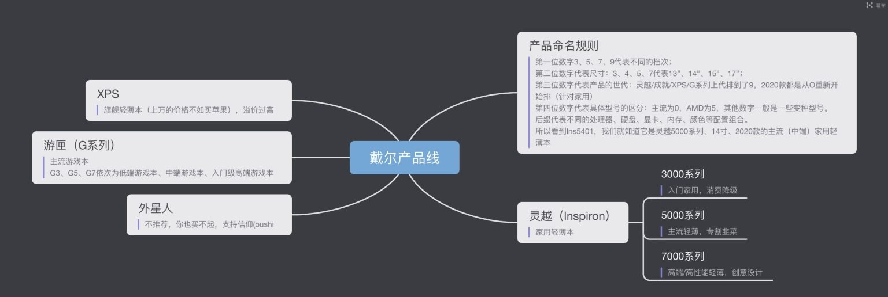

---  
title: 如何选择一款心仪的笔记本电脑
description: 简单总结了一些笔记本的选购技巧
date: 2022-07-21
slug: 笔记本选购指南
image: cover.jpeg
categories:
    - 指南
tags:  
    - 笔记本
    - 新生
---

> 本页面尽可能完善一款笔记本的外观、各家产品线、以及性能上的科普，如有缺失，欢迎批评指正。请联系JLUBook服务号`391895681`。

## 笔记本种类以及选择

毕竟电脑说到底是个拿来干活（或者打游戏）的工具。想选到一个合适的笔记本至少需要知道自己需要什么，这也是本段想主要传达的内容。

笔记本电脑主要可分为轻薄笔记本、全能本、高性能笔记本（游戏本）。还有一个相对小众的类别二合一笔记本，这里并不涉及。

这里的分类是针对便携性以及性能的区别来进行区分的。首先在笔记本的基本规律是：性能越强、重量和体积就不可避免会更大，便携性就会更差。所以需要按照自己的需求先确定目标笔记本的类别。

提供一个简单判别笔记本种类的原则：观看笔记本参数（主要关注尺寸、重量、CPU显卡型号）：轻薄本一般尺寸在14寸、重量1.5kg以下、不带有独立显卡或者配置有低端的MX/锐炬显卡；全能本一般尺寸在14/16寸、重量1.5-2kg，带有RTX/GTX xx50系列的显卡；游戏本一般尺寸16寸及以上、重量大于2kg，会按照价格配有RTX/GTX xx50/xx60/xx70/xx80等独立显卡。

-   轻薄本和游戏本的区别是全方位的，轻薄本普遍拥有游戏本一半的重量以及更小的尺寸、更长的续航；在校园内移动时会十分舒适。而游戏本的性能完全碾压轻薄本，如果需要性能（打游戏、专业软件），轻薄本的体验会十分差劲。
-   全能本介于轻薄本和游戏本中间，是两者优缺点折中之后的结果。
-   如果能明确自己完全不需要游戏本的性能（完全不打高配游戏、所学专业所用软件不需要高性能），则建议选择轻薄本。反之选择游戏本。
-   如果不能明确或者想兼顾性能和便携性，可以考虑选择全能本。（换句话说就是，啥都来一点，能打游戏，能剪视频，能写代码这种）

## 笔记本预算

在这里提供一下各种类的预算下限（仅供参考），这个下限的意思是低于这个预算很难买到各方面都合格的电脑。

轻薄本的下限是3000元，全能本的下限是4000元，游戏本的下限是5000元

如果有人推荐了远低于这个下限的电脑，请当骗子处理。

## 笔记本外观

### ① A面（顶盖）

一般而言顶盖印有的是品牌的logo以及外观设计的样式。建议女孩子们在意颜值的可以看看

### ② B面（屏幕）

#### (1)基础指标

-   屏幕尺寸（一般采用英寸：轻薄本为14″,全能本为14″~15.6″，游戏本为15.6″以上)
-   可视面积与实际面积（一般针对于屏占比还有深恶痛绝的刘海屏）
-   横纵比【水平：垂直，较常见为4:3，16:9（视频图像），16:10（后期影视处理）以及3:2（文字处理）】
-   分辨率（点/平方英寸；dpi）
-   点距（毫米；通常为0.18-0.25mm）
-   刷新率（赫兹；Hz）：一个显示器在一秒内页面刷新的次数，目前主流的有60Hz、120Hz、144Hz、240Hz 。此值越大越好。
-   亮度（尼特；nit）阳光下阅读的可视能力，亮度太高会影响视力
-   对比度：最高亮度比最低亮度
-   能耗（瓦特；W）：显示器进入待机状态下的能耗较小。
-   响应时间（毫秒；ms）：一个像素从活动（黑）到静止（白）状态，再返回到活动状态所用的时间。数值越小越好。
-   可视角度：在纵横方向可以看到影像的最大角度。
-   色域：目前有sRGB、DCI-P3、AdobeRGB等，显示面积以及显示的范围会有出入，不是一一完全包含的关系。（显示面积是与CIE1931XYZ色彩空间图为比照）
-   色深：描述颜色过渡的一定数值，数值越大越好。
-   色准：数值越小越好，一般△E<3肉眼分不出差别。

#### (2)基础硬件

目前主流屏幕分为两大类，一个是LCD、另一个是OLED。

对于LCD而言，现在的背光技术是LED，其下又包括IPS、TN、VA等主流电脑屏幕。也就是经常在网络上看到的这些屏幕。优缺点如下所示。

|   | 优点 | 缺点 |
|:--:|--|--|
| TN | 技术时间历史悠久，成本低廉。不通电的情况下显示，发光效率高。达到相同亮度比其他方式更省电。所以在低成本的便携式电子设备上广泛使用。反应速度快，在高刷新率萤幕上广泛采用。 | 可视角度狭窄。从侧看萤幕亮度显著变暗，色彩与画面严重失真。色彩和对比度表现逊色。大部分均为原生6 Bit的面板，仅能显示红、绿、蓝各64色，最大实际色彩仅有26.2万色。经抖色后方接近1670万色（8 bit色彩）。像素损坏后多会形成亮点，对使用者影响较高（而VA及IPS面板像素损坏后大多会形成暗点或色点，相较下视觉影响较低）。 |
| VA | 对比度高。漏光程度较IPS低。色温较温和，色彩表现较为艳丽。可视角可达178度，有改善TN版面失色的问题。 | 虽然有广视角的优点，但侧看屏幕会有偏白的情况，较IPS稍差。色彩还原真实度亦稍逊于IPS。不如新一代IPS屏幕省电。|
| IPS | 可视角度极佳，达178度。新款IPS电力消耗相对较VA少。硬式面板，很适合做成受压的触屏。色彩比起VA更鲜艳，色彩还原度较为真实，较适合运用于对色彩还原要求高的电脑图像。 | 成本昂贵。漏光特性，在黑色及暗色系的表现稍逊。相较于VA系列面板，对比度稍差。早期IPS反应速度较慢，容易有残影。AH-IPS技术出现后已有最高到4ms屏幕改善问题。色温偏低，有偏黄倾向，例如iPhone的IPS就有天生的黄屏问题、采用相似技术的移动电话屏幕也是如此，需要专用补正电路。容易有色温不均（阴阳屏）状况。 |

对于OLED 屏幕而言，小白只需要记住由于没有背光层的存在，与LCD相比优点为就没有漏光的现象；以及屏幕响应时间在日常使用中较短（不会出现快速滑动屏幕出现残影的现象）。缺点就是寿命短。

同样的，对于目前技术而言，下一代技术为OLET、mini LED和micro LED。感兴趣可以自己了解

#### (3)显示技术——HDR和HDR Vivid

可以点击这里进行了解：[HDR](https://displayhdr.org/#tab-400)/[HDR Vivid](https://www.hisilicon.com/cn/techtalk/hdr-vivid)

#### (4)总结

高分辨率（2.5K/4K）可以提升文字工作以及视频、游戏的体验，但是会加大显卡负担、降低游戏帧数；如果有打游戏的需求，不建议选择xx60以下显卡并搭配高分辨率屏幕。高刷新率（90hz/120hz/144hz/165hz）可以显著提升fps等游戏的体验，如果常玩游戏优先选择。如果遇见了采用了低色域屏幕的笔记本，请不要优先选择。

### ③ C面（键盘）

一般考虑的为键程大小，手感效果还有是否有小键盘。有的笔记本电脑在C面两侧会做扬声器孔。感兴趣的可以了解机械键盘的轴体类别，这里不过多进行介绍。

### ④ D面（和E面）

一般考虑的是散热问题，有的电脑会多出来一块E面，如荣耀猎人v700。

### ⑤ IO接口

购买时接口越多越好。一般包括DP、USB-A/C、HDMI、网口、DispayPort、Thunderbolt雷电接口等。

接口少的话就得需要外接一个扩展坞。

主要关注USB-type A（方口）的数量，游戏本建议不少于两个（外接鼠标和键盘）；轻薄本建议不少于一个。如果外接显示器，需要关注一下视频接口（HDMI/DP）的规格是否满足自己的需要。

## 性能＆散热

对于用户使用体验的决定性硬件是CPU和显卡。绝大多数使用场景都需要CPU主导、CPU真正决定了电脑使用体验的下限。但对于绝大多数人的情况来说，主流的R5/I5（6核及以上）即可满足所有需求。没有特殊需求的话CPU没有优先高配的必要。

显卡的适用场景是游戏、建模、视频剪辑、科学计算、深度学习等特定软件。如果对这些软件有长期需求，则选择策略要向显卡倾斜。这里以打游戏为例说明显卡的选择思路：完全不打游戏/轻度网游（比如LOL、DOTA或是小型独立游戏）——随意购买；主要玩网游——推荐至少选择RTX xx50的显卡；主要玩配置要求高的单机游戏或是高帧率的需求（比如FPS游戏：APEX CSGO等）——建议至少RTX xx60的显卡，上不封顶。

### ① CPU

天梯图请[点击这里](https://rank.kkj.cn/mcpu3.shtml)，数值越大越好。对于天梯图而言，显示的是最新一代的处理器，目前而言Intel为12代、AMD为zen3。（比如你要买的电脑是11代的Intel处理器，那你得去另查，查分数之后再与天梯图做对比，换句话说就是12代i5>11代i7>11代i5，AMD同理）

### ② 显卡

天梯图请[点击这里](https://rank.kkj.cn/mgpu3.shtml)，数值越大越好。

### ③ 散热

散热以及硬件配置会区别性能。散热越强性能越强，同散热水平下高配硬件性能更强。有些散热较差但配置高的游戏本实际体验可能跟低配置强散热的型号差不多。

##  相关认证和技术

一般而言包括Intel Evo认证（运行速度和续航等使用体验），NVIDIA DLSS（同画质下游戏帧率上升），HDR等认证内容。

技术上，最常见的是独显直连技术（这个功能只在游戏本上有用，如果不外接屏幕且打游戏的话，有独显直连会使得游戏帧数上升，建议作为加分项考虑。）

## 拓展性

目前笔记本可以扩展的硬件为内存以及硬盘；一般来说较好的情况是内存16G（双槽均可换，可以加至32G）、拥有两个nvme m.2 硬盘位置（出厂自带一个硬盘）。轻薄本在这方面普遍会有减配（比如少一个内存槽或硬盘位）。游戏本普遍满足上面的描述，但是少量游戏本会在这方面动手（比如戴尔部分游戏本）。可以通过查找拆解评测了解目标笔记本的情况。如果想长期使用电脑，尽量选择扩展性强的型号。

## 如何看具体型号

首先按照之前确定的范围筛选一些产品（比如在京东筛选），或是去看看评测媒体的推荐。

然后建议去信誉良好的评测媒体观看评测视频（中正评测/笔吧评测室/极客湾等），了解电脑的具体情况。

## 各家品牌的产品线

> 可点击图片放大查看 👀 （截止到2022.07）

 

 